# EoX-PSIRT-API-Usage

The EoX and PSIRT API provides a RESTful interface to return valuable information regarding End-of-Life and vulnerability product information. This brief document will be an overview of the main features of these API interfaces, how to authorize their usage, and what sort of data can be returned depending on what is provided.

**For more EoX and PSIRT API information, please visit the following links:**

EoX API: https://developer.cisco.com/docs/support-apis/#!eox

PSIRT API: https://developer.cisco.com/docs/psirt/#!api-reference

## EoX and PSIRT API Registration

- Visit https://apiconsole.cisco.com/ and sign in at the top of the page
  
  

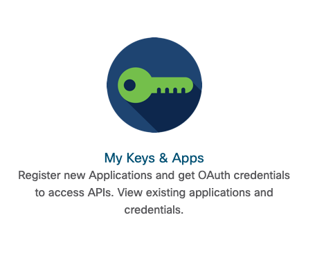

- Click on **My Keys & Apps** on the bottom right of the screen
  
  

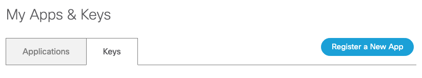

- Click on the blue **Register a New App** icon at the top right of the page
  
  

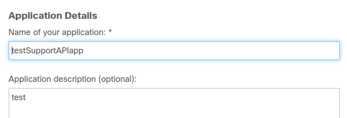

- Enter a **name** and **description** (optional) for your application
  
  

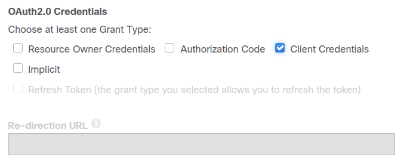

- Under OAuth2.0 Credentials, select **Client Credentials** only
  
  

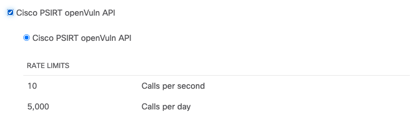

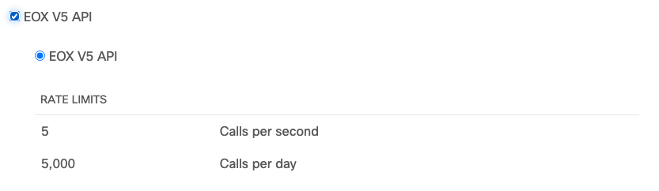

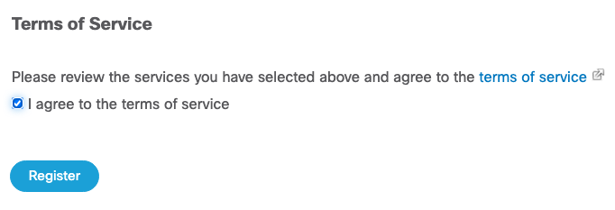

- Select both **Cisco PSIRT openVuln API** and **EoX V5 API***, agree to the Terms of Service at the bottom of the page, and hit Register.

 *Note: EoX V5 API and some other Support APIs will only be visible if you have a valid Smart Net Total Care Support (SNTC) or Partner Support Service (PSS) contract with Cisco, the PSIRT openVuln API is open to the public and will be available regardless of contract status*
  
- An email will be sent providing details of the application registration, as well as the client ID and client secret, or you can re-visit the My Apps & Keys page to view the details
  
  

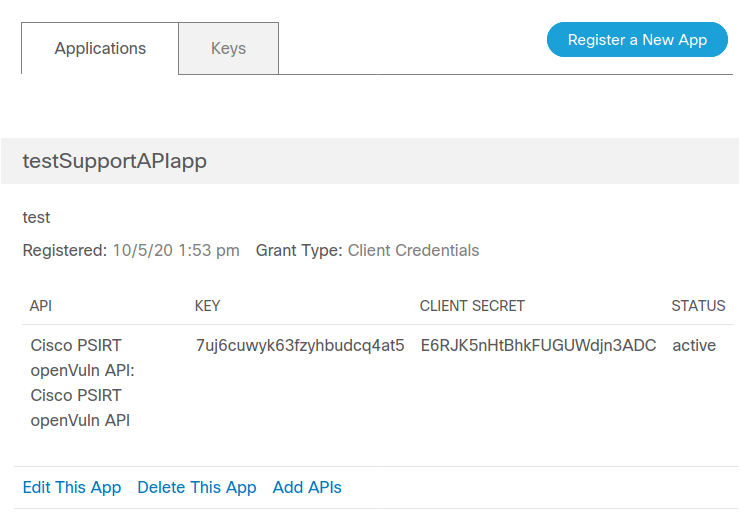

- Once your application is registered, you can view it from the list in the **My Apps & Keys** tab
- From the **Applications** selector you can edit your application's name/description, and add additional API access
- Take note of both the **Key** and **Client Secret** for both the 'Cisco PSIRT openVuln API' and 'EOX V5 API', you will need these to authorize your API calls from your program
  
  

## API Usage in Postman

### Importing Collections

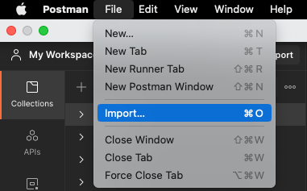

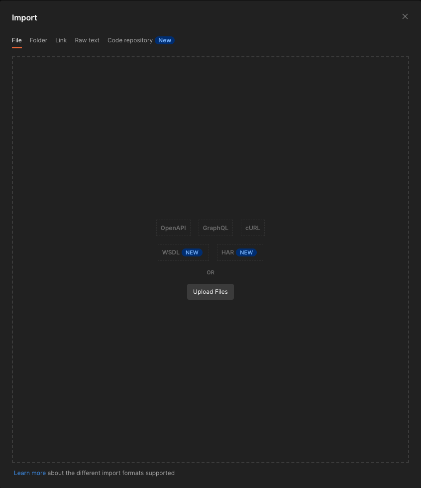

- In the top left, select File > Import > Upload Files, select the two downloaded Postman collection json files from the repo, and hit **Import** in the next window to import the collections locally

### Authentication 

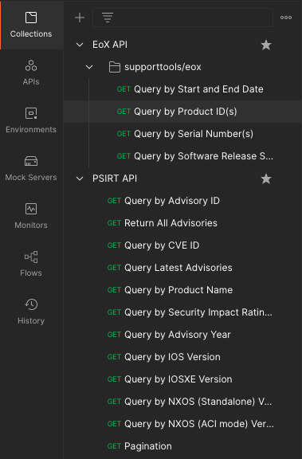

- After importing, select a query/API call you would like to use from either EoX or PSIRT collection, in this case we will use **Query by Product ID(s)**
  
  

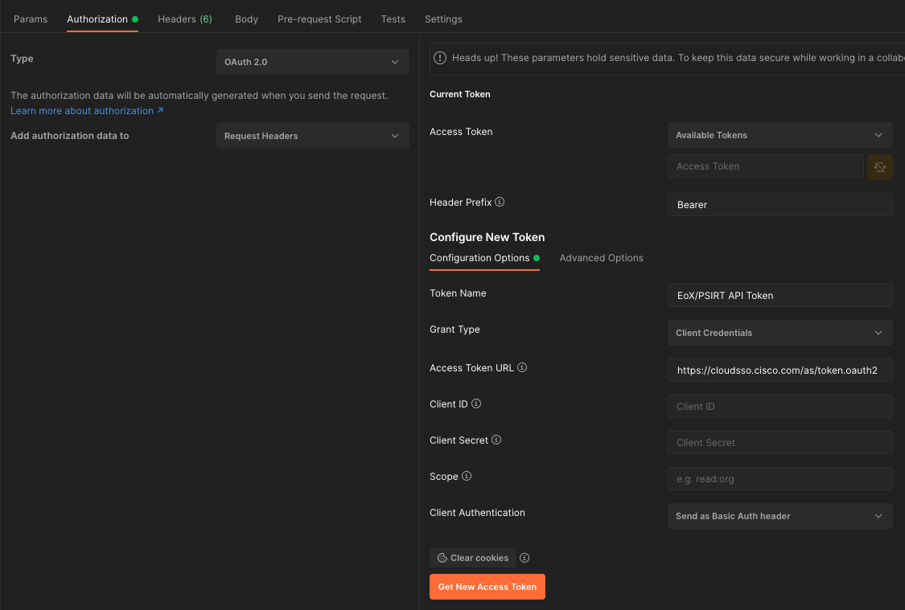

- Under the **Authentication** tab, enter a name for your token in the **Token Name** field if you wish to change it. Using the info from **My Apps & Keys** from your Cisco API Console account, enter your **key** under **Client ID** and your **Client Secret** in the **Client Secret** field, and hit **Get New Access Token**
  
  

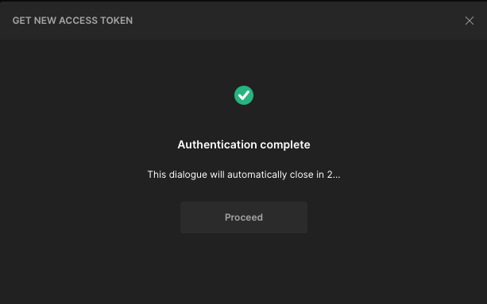

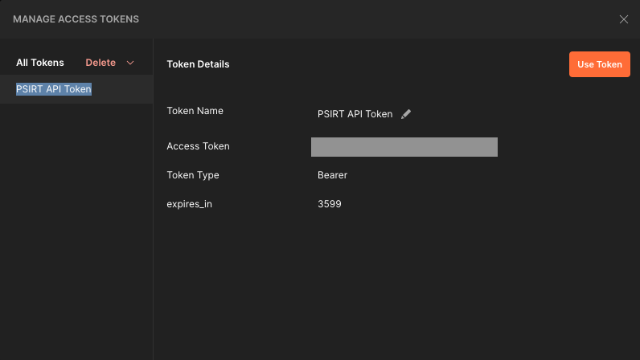

- If the request returns a success, hit the **Proceed** icon, and then the orange **Use Token** icon on the next window

*Note: Generating a new token only needs to be completed once until the token expires (it expires a set time after inactivity or until aged out, you will receive a **403 Forbidden** status and **Not Authorized** in the response field if your token expires). Once the token expires, hit the orange **Get New Access Token** and ensure the new token is selected in the **Access Token** field*

- After earning an Access Token, select your new token from the **Access Token** drop down menu. For each API in the collection, your active token will need to be selected before executing your API calls. Save your newly entered authentication details (PC: **Ctrl+S** / Mac: **Command+S**)
  
  

### API Usage

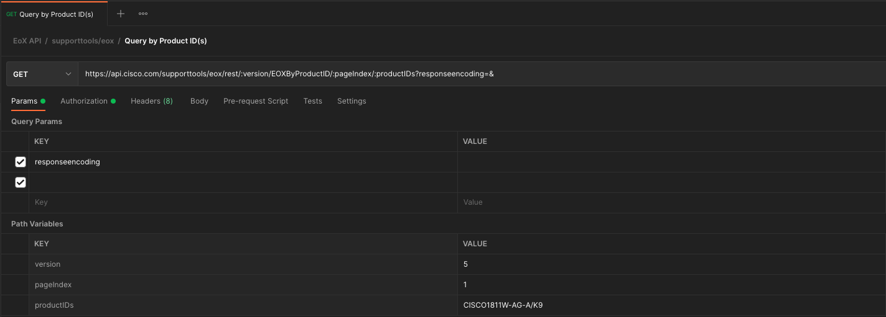

- Return to the API parameters by hitting the **Params** tab, and in the case of this API call, enter the **productID** you wish to have EoX data returned on. Here, we will be querying EoX data for the PID, **CISCO1811W-AG-A/K9** . We can see the API we're using in the field that **GET** provides above the tabs
- When ready to query, hit the blue **Send** button in the top right of the Postman console
  
  

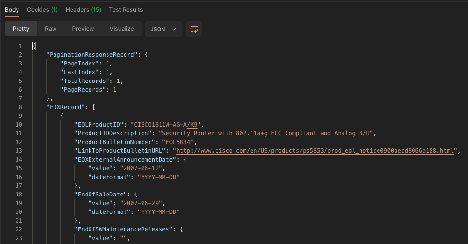

- The response to the query will be displayed in the bottom window under the **Body** tab, here you can view all the response data in JSON or XML *Note: Full example responses are available in the **examples** folder in this repository*